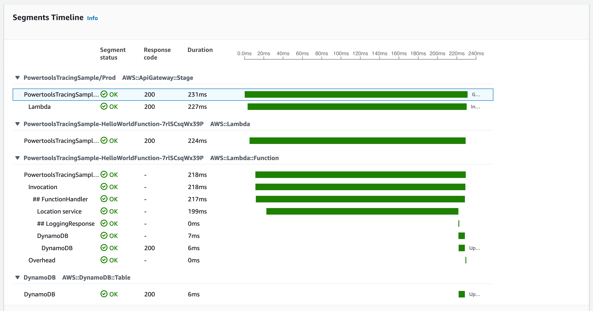

Powertools tracing is an opinionated thin wrapper for [AWS X-Ray .NET SDK](https://github.com/aws/aws-xray-sdk-dotnet/)
a provides functionality to reduce the overhead of performing common tracing tasks.



## Key Features

* Helper methods to improve the developer experience for creating [custom AWS X-Ray subsegments](https://docs.aws.amazon.com/xray/latest/devguide/xray-sdk-dotnet-subsegments.html).
* Capture cold start as annotation.
* Capture function responses and full exceptions as metadata.
* Better experience when developing with multiple threads.
* Auto-patch supported modules by AWS X-Ray

## Getting Started

Before you use this utility, your AWS Lambda function [must have permissions](https://docs.aws.amazon.com/lambda/latest/dg/services-xray.html#services-xray-permissions) to send traces to AWS X-Ray.

To enable active tracing on an AWS Serverless Application Model (AWS SAM) AWS::Serverless::Function resource, use the `Tracing` property. You can use the Globals section of the AWS SAM template to set this for all  

### Using AWS Serverless Application Model (AWS SAM)

=== "template.yaml"

    ```yaml hl_lines="8 11"
    Resources:
        HelloWorldFunction:
            Type: AWS::Serverless::Function
            Properties:
            ...
            Runtime: dotnet6.0
    
            Tracing: Active
            Environment:
                Variables:
                    POWERTOOLS_SERVICE_NAME: example
    ```

The Powertools service name is used as the X-Ray namespace. This can be set using the environment variable
`POWERTOOLS_SERVICE_NAME`

## Full list of environment variables

| Environment variable | Description | Default |
| ------------------------------------------------- | --------------------------------------------------------------------------------- |  ------------------------------------------------- |
| **POWERTOOLS_SERVICE_NAME** | Sets service name used for tracing namespace, metrics dimension and structured logging | `"service_undefined"` |
| **POWERTOOLS_TRACE_DISABLED** | Disables tracing | `false` |
| **POWERTOOLS_TRACER_CAPTURE_RESPONSE** | Captures Lambda or method return as metadata. | `true` |
| **POWERTOOLS_TRACER_CAPTURE_ERROR** | Captures Lambda or method exception as metadata. | `true` |

### Lambda handler

To enable Powertools tracing to your function add the `[Tracing]` attribute to your `FunctionHandler` method or on
any method will capture the method as a separate subsegment automatically. You can optionally choose to customize
segment name that appears in traces.

=== "Tracing attribute"

    ```c# hl_lines="3 14 20"
    public class Function
    {
        [Tracing]
        public async Task<APIGatewayProxyResponse> FunctionHandler
            (APIGatewayProxyRequest apigProxyEvent, ILambdaContext context)
        {
            await BusinessLogic1()
                .ConfigureAwait(false);
    
            await BusinessLogic2()
                .ConfigureAwait(false);
        }
        
        [Tracing]
        private async Task BusinessLogic1()
        {
    
        }
    
        [Tracing]
        private async Task BusinessLogic2()
        {
    
        }
    }
    ```

=== "Custom Segment names"

    ```c# hl_lines="3"
    public class Function
    {
        [Tracing(SegmentName = "YourCustomName")]
        public async Task<APIGatewayProxyResponse> FunctionHandler
            (APIGatewayProxyRequest apigProxyEvent, ILambdaContext context)
        {
            ...
        }
    }
    ```

By default, this attribute will automatically record method responses and exceptions. You can change the default behavior by setting
the environment variables `POWERTOOLS_TRACER_CAPTURE_RESPONSE` and `POWERTOOLS_TRACER_CAPTURE_ERROR` as needed. Optionally, you can override behavior by different supported `CaptureMode` to record response, exception or both.

!!! warning "Returning sensitive information from your Lambda handler or functions, where `Tracing` is used?"
    You can disable attribute from capturing their responses and exception as tracing metadata with **`captureMode=DISABLED`**
    or globally by setting environment variables **`POWERTOOLS_TRACER_CAPTURE_RESPONSE`** and **`POWERTOOLS_TRACER_CAPTURE_ERROR`** to **`false`**

=== "Disable on attribute"

    ```c# hl_lines="3"
    public class Function
    {
        [Tracing(CaptureMode = TracingCaptureMode.Disabled)]
        public async Task<APIGatewayProxyResponse> FunctionHandler
            (APIGatewayProxyRequest apigProxyEvent, ILambdaContext context)
        {
            ...
        }
    }
    ```

=== "Disable Globally"

    ```yaml hl_lines="11 12"
    Resources:
        HelloWorldFunction:
            Type: AWS::Serverless::Function
            Properties:
            ...
            Runtime: dotnetcore3.1
    
            Tracing: Active
            Environment:
                Variables:
                    POWERTOOLS_TRACER_CAPTURE_RESPONSE: false
                    POWERTOOLS_TRACER_CAPTURE_ERROR: false
    ```

### Annotations & Metadata

**Annotations** are key-values associated with traces and indexed by AWS X-Ray. You can use them to filter traces and to
create [Trace Groups](https://aws.amazon.com/about-aws/whats-new/2018/11/aws-xray-adds-the-ability-to-group-traces/) to slice and dice your transactions.

**Metadata** are key-values also associated with traces but not indexed by AWS X-Ray. You can use them to add additional
context for an operation using any native object.

=== "Annotations"

    You can add annotations using `AddAnnotation()` method from Tracing
    ```c# hl_lines="9"
    using AWS.Lambda.Powertools.Tracing;

    public class Function
    {
        [Tracing]
        public async Task<APIGatewayProxyResponse> FunctionHandler
            (APIGatewayProxyRequest apigProxyEvent, ILambdaContext context)
        {
            Tracing.AddAnnotation("annotation", "value");
        }
    }
    ```

=== "Metadata"

    You can add metadata using `AddMetadata()` method from Tracing
    ```c# hl_lines="9"
    using AWS.Lambda.Powertools.Tracing;

    public class Function
    {
        [Tracing]
        public async Task<APIGatewayProxyResponse> FunctionHandler
            (APIGatewayProxyRequest apigProxyEvent, ILambdaContext context)
        {
            Tracing.AddMetadata("content", "value");
        }
    }
    ```

## Utilities

Tracing modules comes with certain utility method when you don't want to use attribute for capturing a code block
under a subsegment, or you are doing multithreaded programming. Refer examples below.

=== "Functional Api"

    ```c# hl_lines="8 9 10 12 13 14"
    using AWS.Lambda.Powertools.Tracing;
    
    public class Function
    {
        public async Task<APIGatewayProxyResponse> FunctionHandler
            (APIGatewayProxyRequest apigProxyEvent, ILambdaContext context)
        {
            Tracing.WithSubsegment("loggingResponse", (subsegment) => {
                // Some business logic
            });
    
            Tracing.WithSubsegment("localNamespace", "loggingResponse", (subsegment) => {
                // Some business logic
            });
        }
    }
    ```

=== "Multi Threaded Programming"

    ```c# hl_lines="13-16"
    using AWS.Lambda.Powertools.Tracing;

    public class Function
    {
        public async Task<APIGatewayProxyResponse> FunctionHandler
            (APIGatewayProxyRequest apigProxyEvent, ILambdaContext context)
        {
            // Extract existing trace data
            var entity = Tracing.GetEntity();
            
            var task = Task.Run(() =>
            {
                Tracing.WithSubsegment("InlineLog", entity, (subsegment) =>
                {
                    // Business logic in separate task
                });
            });
        }
    }
    ```

## Instrumenting SDK clients and HTTP calls

User should make sure to instrument the SDK clients explicitly based on the function dependency. Refer details on
[how to instrument SDK client with Xray](https://docs.aws.amazon.com/xray/latest/devguide/xray-sdk-dotnet-sdkclients.html) and [outgoing http calls](https://docs.aws.amazon.com/xray/latest/devguide/xray-sdk-dotnet-httpclients.html).
